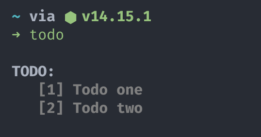
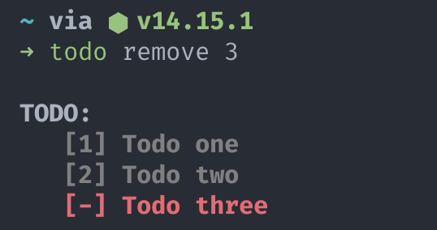

# TODOs
**todo** is a program to keep track of todos with simple commands.

## Installation
Clone repository:
```
git clone https://github.com/francesco-dorati/todos.git
```

Move to /usr/local/bin folder:
```
mv todos /usr/local/bin
```

Add symbolic link:
```
ln -s /usr/local/bin/todo /usr/local/bin/todos/todo.py
```

## Usage
#### Get all TODOs:
```
todo
```


#### Add a TODO:
```
todo add [todo]
```


#### Remove a TODO:
```
todo remove [index]
``` 

